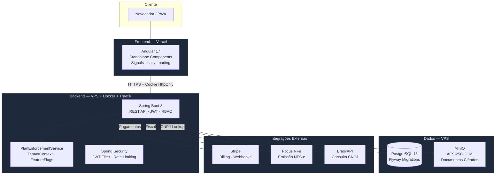
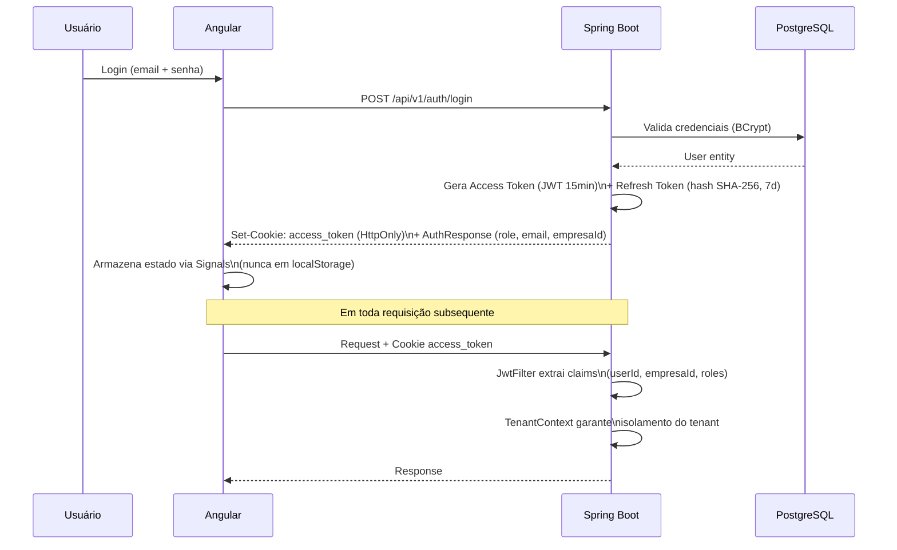
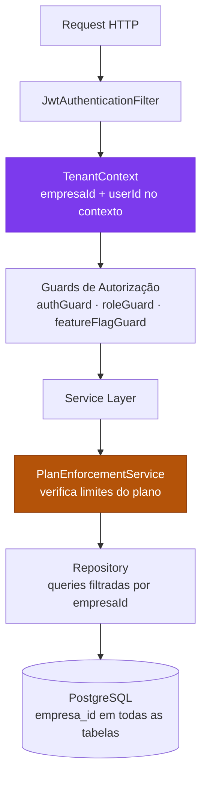
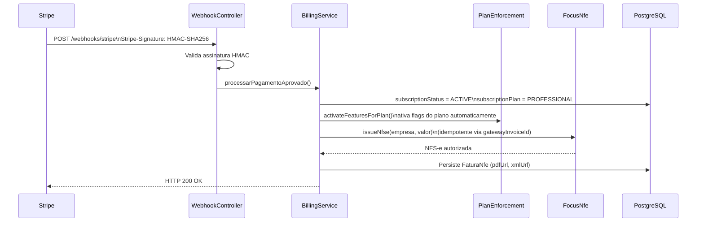
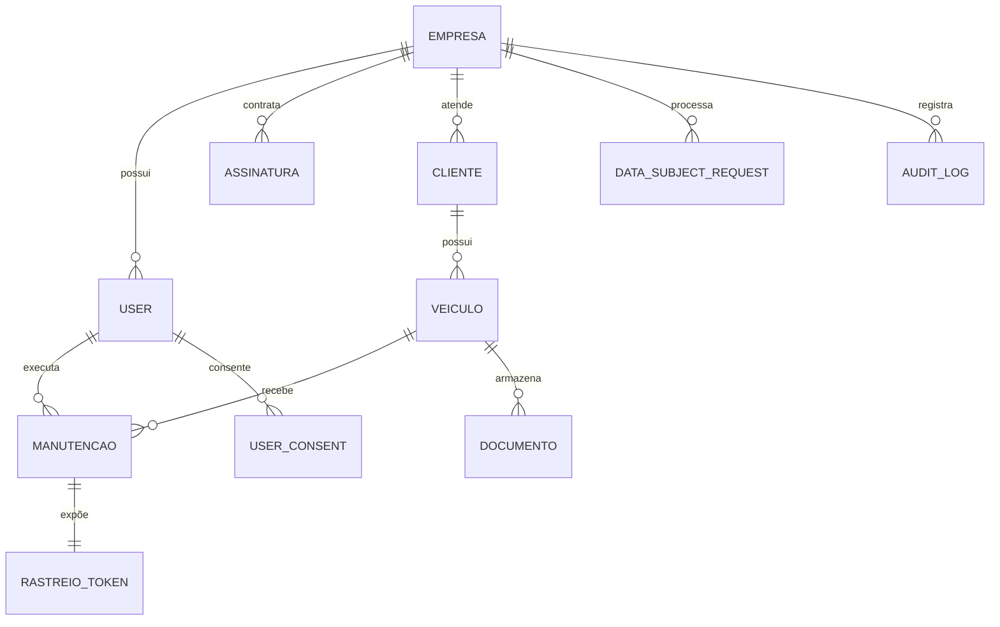

<div align="center">


# PitStop Manager

**SaaS completo para gestão de oficinas automotivas.**

Centralize ordens de serviço, clientes, veículos, documentos, faturamento, metas e acompanhamento do cliente em uma única plataforma moderna, segura e escalável.

_Desenvolvido pela [RiseCode Studio](https://risecodestudio.com.br)_

---

[](https://openjdk.org/projects/jdk/21/)
[](https://spring.io/projects/spring-boot)
[](https://angular.io)
[](https://www.postgresql.org)
[](https://docs.docker.com/compose/)
[](https://stripe.com)
[](https://vercel.com)

---

[](https://managerpitstop.com.br)
[](https://www.gov.br/anpd)
[](https://owasp.org)
[]()
[](https://risecodestudio.com.br)
[](https://managerpitstop.com.br)

---

**[🌐 Acessar o Sistema](https://managerpitstop.com.br)** · **[📡 Status da API](https://api.managerpitstop.com.br/actuator/health)** · **[📧 Contato Comercial](mailto:contato@risecodestudio.com.br)**

</div>

---

## Índice

- [O Problema que Resolvemos](#-o-problema-que-resolvemos)
- [Principais Benefícios](#-principais-benefícios)
- [Screenshots](#-screenshots)
- [Funcionalidades](#-funcionalidades)
- [Planos e Limites](#-planos-e-limites)
- [Arquitetura da Solução](#-arquitetura-da-solução)
- [Diferenciais Técnicos](#-diferenciais-técnicos)
- [Segurança](#-segurança)
- [Conformidade LGPD](#-conformidade-lgpd)
- [Stack Tecnológica](#-stack-tecnológica)
- [Infraestrutura e Deploy](#-infraestrutura-e-deploy)
- [Arquitetura Empresarial](#-arquitetura-empresarial)
- [Por que este projeto demonstra senioridade técnica](#-por-que-este-projeto-demonstra-senioridade-técnica)
- [Engineering Decisions & Trade-offs](#-engineering-decisions--trade-offs)
- [Casos de Uso](#-casos-de-uso)
- [Como Executar Localmente](#-como-executar-localmente)
- [Testes](#-testes)
- [Banco de Dados](#-banco-de-dados)
- [Roadmap](#-roadmap)
- [Licença e Direitos Autorais](#-licença-e-direitos-autorais)

---

## 🔧 O Problema que Resolvemos

A maioria das oficinas mecânicas ainda opera com processos manuais, desconectados e sem rastreabilidade:

| Problema Real                       | Impacto na Oficina                              | Como o PitStop Manager Resolve                                |
| ----------------------------------- | ----------------------------------------------- | ------------------------------------------------------------- |
| Controle em papel ou planilhas      | OS perdidas, retrabalho, erros                  | Gestão digital centralizada com ciclo completo de status      |
| Falta de comunicação com o cliente  | Reclamações, perda de confiança                 | Portal de rastreamento público com token único por OS         |
| Sem histórico de veículos           | Perda de informação, diagnósticos errados       | Histórico completo por veículo com todos os serviços          |
| Documentos espalhados               | CRLV vencido, laudos perdidos                   | Cofre digital criptografado com controle de validade          |
| Sem indicadores gerenciais          | Decisões no escuro, meta impossível de medir    | Dashboard com KPIs e relatórios por mecânico e período        |
| Controle financeiro descentralizado | Faturamento inconsistente, sem histórico fiscal | NFS-e automática, dashboard financeiro e histórico de faturas |
| Dificuldade em gerir equipe         | Mecânicos sem meta clara, sem reconhecimento    | Módulo de metas mensais por mecânico com relatório PDF        |

---

## ✅ Principais Benefícios

<div align="center">

|     | Benefício                 | Descrição                                                       |
| --- | ------------------------- | --------------------------------------------------------------- |
| 🔩  | **Gestão Completa de OS** | Do orçamento à conclusão, com relatório e rastreio público      |
| 🚗  | **Controle de Frota**     | Cadastro de veículos com histórico, documentos e alertas        |
| 📄  | **Cofre de Documentos**   | Upload seguro, criptografado, com controle de validade          |
| 📊  | **Relatórios Gerenciais** (em breve) | KPIs por período, mecânico, status e valor                      |
| 🎯  | **Metas por Mecânico**    | Acompanhamento em tempo real + relatório para RH                |
| 💰  | **Financeiro Integrado**  | Histórico de OS concluídas, valores e faturamento               |
| 🧾  | **NFS-e Automática**      | Emissão fiscal automática a cada pagamento confirmado           |
| 🔒  | **Segurança Corporativa** | AES-256, JWT, RBAC, auditoria completa                          |
| 🏢  | **Multi-Empresa**         | Cada oficina é um tenant isolado, pronto para rede de franquias |
| 📱  | **100% Responsivo**       | Acesso completo de celular, tablet ou computador                |

</div>

---

## 🖥️ Screenshots

> As imagens abaixo mostram o sistema em produção.

<div align="center">

|                Dashboard                |            Ordens de Serviço             |
| :-------------------------------------: | :--------------------------------------: |
|  |                 |
|    _KPIs e visão geral da operação_     | _Gestão completa do ciclo de vida da OS_ |

|                Rastreio Público                 |                Financeiro                 |
| :---------------------------------------------: | :---------------------------------------: |
|            |  |
| _Portal de acompanhamento para o cliente final_ |      _Visão financeira por período_       |

</div>

---

## 📦 Funcionalidades

### Gestão Operacional

| Módulo                  | Descrição                                                                                | Plano    |
| ----------------------- | ---------------------------------------------------------------------------------------- | -------- |
| **Ordens de Serviço**   | Abertura, atribuição, ciclo completo (Aberta → Em Andamento → Concluída) e relatório PDF | Todos    |
| **Rastreio Público**    | Link com token único para o cliente acompanhar a OS sem login                            | Todos    |
| **Gestão de Veículos**  | Placa, chassi, RENAVAM, marca/modelo e histórico de serviços                             | Starter+ |
| **Clientes**            | CPF/CNPJ, telefone, e-mail com mascaramento por perfil                                   | Todos    |
| **Cofre de Documentos** | CRLV, laudos e documentos com pipeline AES-256-GCM + S3                                  | Starter+ |

### Gestão de Pessoas e Metas

| Módulo                 | Descrição                                                     | Plano         |
| ---------------------- | ------------------------------------------------------------- | ------------- |
| **Metas por Mecânico** | Metas mensais, acompanhamento em tempo real e relatório PDF   | Professional+ |
| **Gestão de Usuários** | Criação, ativação e perfis (GERENTE, MECÂNICO, RECEPCIONISTA) | Todos         |

### Financeiro e Faturamento

| Módulo                       | Descrição                                                | Plano         |
| ---------------------------- | -------------------------------------------------------- | ------------- |
| **Módulo Financeiro**        | Visão consolidada das OS por período e valor             | Professional+ |
| **Assinaturas**              | Starter / Professional / Enterprise via Stripe           | —             |
| **NFS-e Automática**         | Emissão Focus NFe a cada `invoice.paid` com idempotência | Todos         |
| **Dashboard de Faturamento** | Histórico com download de PDF/XML das NFS-e              | Todos         |

### Análise e Administração

| Módulo            | Descrição                                                     | Plano         |
| ----------------- | ------------------------------------------------------------- | ------------- |
| **Dashboard**     | KPIs: OS abertas, em andamento, concluídas e valor total      | Todos         |
| **Relatórios** (em breve) | Análises por período, mecânico e serviço                      | Professional+ |
| **Feature Flags** | Toggle de módulos em tempo real via painel Angular            | Admin         |
| **Uso do Plano**  | Métricas de consumo com barras de progresso e aviso de limite | Admin/Gerente |
| **Auto-cadastro** | Signup público com validação matemática de CNPJ e BrasilAPI   | —             |

### Privacidade e LGPD

| Módulo                  | Descrição                                                    |
| ----------------------- | ------------------------------------------------------------ |
| **Consentimento**       | Coleta por versão de política com IP e user-agent — Art. 8   |
| **Portal do Titular**   | Acesso, portabilidade, correção, anonimização — Art. 18      |
| **Exportação de Dados** | JSON estruturado completo (portabilidade)                    |
| **Anonimização**        | Substituição de PII + revogação de sessões + `deleted_at`    |
| **Retenção Automática** | Hard-delete após 90 dias + limpeza de tokens expirados       |
| **Audit Log**           | Registro imutável de todas as operações sobre dados pessoais |

---

## 💳 Planos e Limites

O enforcement é aplicado **no backend** antes de cada operação. Ultrapassar o limite retorna `HTTP 402 Payment Required`.

| Recurso                         |  STARTER  | PROFESSIONAL | ENTERPRISE |
| ------------------------------- | :-------: | :----------: | :--------: |
| **Preço**                       | R$ 89/mês |  R$ 179/mês  | R$ 349/mês |
| **OS por mês**                  |    50     |  Ilimitado   | Ilimitado  |
| **Mecânicos ativos**            |     2     |  Ilimitado   | Ilimitado  |
| **Armazenamento**               |   5 GB    |    50 GB     | Ilimitado  |
| Gestão de Veículos              |    ✅     |      ✅      |     ✅     |
| Cofre de Documentos             |    ✅     |      ✅      |     ✅     |
| Metas / Financeiro               |    ❌     |      ✅      |     ✅     |
| Relatórios                       |    ❌     |      🔜      |     🔜     |
| Notificações                    |    ❌     |      ✅      |     ✅     |
| Integração DETRAN               |    ❌     |      ❌      |     🔜     |
| API Pública                     |    ❌     |      ❌      |     🔜     |
| SLA Garantido                   |    ❌     |      ❌      |   99,9%    |

> 🔜 = em desenvolvimento/roadmap — ainda não disponível para uso.

> **Como funciona:** ao confirmar o pagamento via webhook Stripe, o `PlanEnforcementService` ativa automaticamente as feature flags do plano e desativa as demais. Nenhuma intervenção manual necessária.

---

## 🏗️ Arquitetura da Solução



### Fluxo de Autenticação



### Fluxo Multi-Tenant



### Fluxo Stripe → NFS-e



---

## ⚡ Diferenciais Técnicos

### Multi-Tenant com Isolamento Real

Cada empresa é um tenant completamente isolado. O `empresaId` é extraído do JWT em cada request, propagado pelo `TenantContext` via `SecurityContextHolder` e verificado em **todas as queries**. Não existe risco de acesso cruzado por design — não apenas por validação.

### RBAC Granular

```
ROLE_ADMIN        → Acesso total ao sistema
ROLE_GERENTE      → Gestão da própria empresa (OS, usuários, relatórios, faturamento)
ROLE_MECANICO     → Apenas próprias OS e metas; dados sensíveis mascarados
ROLE_RECEPCIONISTA→ Abertura e consulta de OS; sem acesso financeiro
```

Dados sensíveis (chassi, RENAVAM, CPF) são mascarados automaticamente por perfil.

### Billing Automatizado End-to-End

Seleção de plano → Stripe Checkout → Webhook validado por HMAC-SHA256 → `subscriptionStatus = ACTIVE` → Feature flags ativadas automaticamente → NFS-e emitida. Zero intervenção manual.

### Feature Flags por Plano

Togglz persiste o estado das flags no banco. Ao confirmar um pagamento, `PlanEnforcementService.activateFeaturesForPlan()` ativa exatamente os módulos do plano contratado e desativa os demais. Administradores podem fazer override via painel Angular.

### Criptografia em Profundidade

- Documentos: **AES-256-GCM** + IV aleatório de 12 bytes antes do upload
- Senhas: **BCrypt** custo 12
- Refresh tokens: apenas o hash **SHA-256** é persistido — o token raw nunca toca o banco
- Sessão: cookies `HttpOnly + Secure + SameSite=None` — nunca `localStorage`

---

## 🔒 Segurança

> Segurança desenvolvida seguindo boas práticas **OWASP Top 10**.

### Camadas de Segurança

| Camada                   | Mecanismo                     | Detalhe                                                       |
| ------------------------ | ----------------------------- | ------------------------------------------------------------- |
| **Autenticação**         | JWT + Refresh Rotation        | Access token (15 min) + Refresh token (7 dias, hash SHA-256)  |
| **Sessão**               | HttpOnly Cookie               | `Secure + SameSite=None` — imune a XSS                        |
| **Autorização**          | RBAC via `@PreAuthorize`      | Verificação por perfil em cada endpoint                       |
| **Isolamento**           | Multi-Tenant Context          | `empresaId` e `userId` em todas as queries                    |
| **Dados em Repouso**     | AES-256-GCM                   | IV aleatório de 12 bytes por documento                        |
| **Senhas**               | BCrypt (custo 12)             | Sem plain-text em nenhum ponto                                |
| **Replay Attack**        | Detecção de token reutilizado | Segundo uso do mesmo refresh revoga toda a família            |
| **Rate Limiting**        | Bucket4j por IP               | 60 req/min com header `X-RateLimit-Remaining`                 |
| **Validação de Arquivo** | Magic Numbers                 | Não confia na extensão — verifica bytes reais do PDF          |
| **Webhook**              | HMAC-SHA256                   | Valida autenticidade de cada evento Stripe                    |
| **Headers HTTP**         | CSP + HSTS headers            | `frame-ancestors 'none'`, Referrer-Policy, Permissions-Policy |
| **Auditoria**            | AuditLog imutável             | Registro de todas as operações sobre dados pessoais           |

---

## 📋 Conformidade LGPD

> O sistema foi projetado com **Privacy by Design** e **Data Protection by Design** desde a arquitetura.

| Artigo         | Requisito                       | Implementação                                                                                   |
| -------------- | ------------------------------- | ----------------------------------------------------------------------------------------------- |
| Art. 8         | Consentimento livre e informado | `UserConsent` com versão, IP e user-agent; tela `/consent` obrigatória antes do primeiro acesso |
| Art. 9         | Transparência no tratamento     | Política de Privacidade e Termos de Uso públicos e versionados                                  |
| Art. 15        | Encerramento do tratamento      | `DataRetentionService`: hard-delete automático após 90 dias                                     |
| Art. 18, I–II  | Acesso e confirmação            | `GET /api/v1/lgpd/my-data` exporta JSON completo com todos os dados                             |
| Art. 18, III   | Correção de dados               | DSAR tipo `CORRECTION` com prazo de 15 dias rastreável                                          |
| Art. 18, IV–VI | Anonimização e eliminação       | `LgpdService.anonymizeUser()` substitui PII + revoga todas as sessões                           |
| Art. 18, V     | Portabilidade                   | Export estruturado para download imediato                                                       |
| Art. 18, IX    | Oposição ao tratamento          | DSAR tipo `OBJECTION` com fluxo completo de resposta                                            |
| Art. 46        | Medidas de segurança            | `AuditLog` imutável em 100% das operações sobre dados pessoais                                  |

**DPO:** privacidade@risecodestudio.com.br · **ANPD:** [gov.br/anpd](https://www.gov.br/anpd)

---

## 🛠️ Stack Tecnológica

### Backend

| Tecnologia          | Versão   | Uso                                              |
| ------------------- | -------- | ------------------------------------------------ |
| Java                | 21 (LTS) | Linguagem principal com Virtual Threads          |
| Spring Boot         | 3.3.2    | Framework base, auto-configuration               |
| Spring Security     | 6.x      | JWT, RBAC, CORS, CSRF, headers de segurança      |
| Spring Data JPA     | 3.x      | ORM, repositórios, auditoria automática          |
| Hibernate           | 6.x      | `@SQLRestriction` para soft-delete transparente  |
| Flyway              | 10.x     | Migrations versionadas V1–V8                     |
| Togglz              | 4.x      | Feature flags persistidas no banco               |
| Bucket4j            | 8.x      | Rate limiting por IP                             |
| OpenPDF             | 1.x      | Geração de relatórios PDF de metas               |
| jjwt                | 0.12.x   | JWT com HS512                                    |
| Hibernate Validator | 8.x      | `@CNPJ`, `@CPF`, `@Placa`, `@Chassi`, `@Renavam` |

### Frontend

| Tecnologia      | Versão     | Uso                                                 |
| --------------- | ---------- | --------------------------------------------------- |
| Angular         | 17         | Framework SPA com Standalone Components             |
| Signals         | (built-in) | Estado reativo sem RxJS para UI/auth/flags          |
| RxJS            | 7.8        | HTTP, Guards, Interceptors                          |
| Reactive Forms  | (built-in) | Formulários com validadores customizados            |
| Tailwind CSS    | 3.x        | Design system com paleta `petroleum/safety/surface` |
| Karma + Jasmine | —          | Testes unitários de componentes e serviços          |

### Banco de Dados e Storage

| Tecnologia    | Uso                                                   |
| ------------- | ----------------------------------------------------- |
| PostgreSQL 15 | Banco relacional principal                            |
| MinIO         | Object storage S3-compatível para documentos cifrados |
| Flyway        | Versionamento e rastreabilidade das migrações         |

### Integrações Externas

| Integração    | Finalidade                             | Resiliência                                                |
| ------------- | -------------------------------------- | ---------------------------------------------------------- |
| **Stripe**    | Pagamentos, checkout, webhooks         | Validação HMAC-SHA256; idempotência por `gatewayInvoiceId` |
| **Focus NFe** | Emissão automática de NFS-e            | Mock local sem `FOCUS_NFE_TOKEN`; idempotência garantida   |
| **BrasilAPI** | Consulta de CNPJ (gratuita, sem chave) | Fallback gracioso em timeout                               |

---

## 🚀 Infraestrutura e Deploy

```
┌─────────────────────────────────────────────────────────┐
│                    PRODUÇÃO                             │
│                                                         │
│  ┌──────────────┐      ┌────────────────────────────┐  │
│  │    Vercel    │      │       VPS Linux            │  │
│  │              │      │                            │  │
│  │  Angular 17  │─────▶│  Traefik (Reverse Proxy)   │  │
│  │  CDN Global  │      │  TLS Automático (ACME)     │  │
│  │  set-env.js  │      │                            │  │
│  └──────────────┘      │  ┌────────────────────┐   │  │
│                         │  │   Spring Boot      │   │  │
│  managerpitstop.com.br  │  │   Container Docker │   │  │
│                         │  └────────┬───────────┘   │  │
│                         │           │               │  │
│                         │  ┌────────▼───────────┐   │  │
│                         │  │   PostgreSQL 15    │   │  │
│                         │  └────────────────────┘   │  │
│                         │                            │  │
│                         │  ┌────────────────────┐   │  │
│                         │  │   MinIO            │   │  │
│                         │  │  (Docs Cifrados)   │   │  │
│                         │  └────────────────────┘   │  │
│                         └────────────────────────────┘  │
└─────────────────────────────────────────────────────────┘
```

### Variáveis de Ambiente — Produção

| Variável                | Onde   | Descrição                               |
| ----------------------- | ------ | --------------------------------------- |
| `VITE_API_URL`          | Vercel | `https://api.managerpitstop.com.br/api` |
| `DATABASE_URL`          | VPS    | JDBC URL do PostgreSQL                  |
| `JWT_SECRET`            | VPS    | Segredo HS512 — mínimo 64 caracteres    |
| `ENCRYPTION_MASTER_KEY` | VPS    | Chave AES-256 para documentos           |
| `CORS_ALLOWED_ORIGINS`  | VPS    | `https://managerpitstop.com.br`         |
| `STRIPE_SECRET_KEY`     | VPS    | Chave Stripe (mock sem ela)             |
| `STRIPE_WEBHOOK_SECRET` | VPS    | Segredo HMAC-SHA256                     |
| `FOCUS_NFE_TOKEN`       | VPS    | Token Focus NFe (mock sem ele)          |
| `STORAGE_ENDPOINT`      | VPS    | Endpoint MinIO                          |

---

## 🏛️ Arquitetura Empresarial

### Visão em Camadas

```
┌────────────────────────────────────────────────────────────┐
│  Controller Layer    → Validação de entrada, autorização   │
│  (REST endpoints)      HTTP 4xx para contratos violados    │
├────────────────────────────────────────────────────────────┤
│  Service Layer       → Regras de negócio, orquestração     │
│  (Business Logic)      Transações, enforcement de plano    │
├────────────────────────────────────────────────────────────┤
│  Repository Layer    → Acesso a dados com filtro de tenant │
│  (Spring Data JPA)     Queries filtradas por empresaId     │
├────────────────────────────────────────────────────────────┤
│  Domain Layer        → Entidades, enums, validações        │
│  (Entities/Enums)      Modelo de domínio rico              │
└────────────────────────────────────────────────────────────┘
```

**Benefícios:** desacoplamento entre camadas, testabilidade unitária em cada nível, substituição de implementações sem impacto no restante.

### Modelagem de Domínio



### Destaques Arquiteturais

| Decisão        | Implementação                 | Motivo                                             |
| -------------- | ----------------------------- | -------------------------------------------------- |
| Multi-Tenant   | `TenantContext` + claims JWT  | Isolamento garantido por design, não por validação |
| Feature Flags  | Togglz + banco                | Toggle em runtime sem redeploy                     |
| Billing        | Stripe + webhook              | Receita automatizada, auditável e idempotente      |
| Storage        | MinIO + AES-256-GCM           | Zero confiança no provedor de armazenamento        |
| Migrações      | Flyway versionado             | Rastreabilidade e deploy seguro                    |
| Frontend State | Angular Signals               | Reatividade sem overhead do NgRx                   |
| Testes         | MockitoExtension + WebMvcTest | Cobertura em serviço, controller e filtro          |
| Exceções       | ProblemDetail RFC 7807        | Contrato consistente para todos os erros           |

---

## 🎯 Por que este projeto demonstra senioridade técnica

> Esta seção é dirigida a **recrutadores, Tech Leads, Arquitetos e empresas contratantes** que desejam avaliar a maturidade técnica do projeto.

### Comparação com Sistemas Convencionais

| Aplicação CRUD Comum        | PitStop Manager                                                         |
| --------------------------- | ----------------------------------------------------------------------- |
| Login básico com sessão     | JWT + Refresh Token Rotation + HttpOnly Cookie                          |
| Perfis simples (admin/user) | RBAC corporativo (4 perfis com permissões granulares)                   |
| Cadastro simples            | SaaS Multi-Tenant com isolamento real por empresa                       |
| Sem cobrança                | Billing automatizado (Stripe → Webhook → NFS-e → Feature Flags)         |
| Sem LGPD                    | LGPD implementada: consentimento, portabilidade, anonimização, retenção |
| Sem auditoria               | Audit Log imutável em 100% das operações sobre PII                      |
| Upload simples              | Pipeline AES-256-GCM + verificação por Magic Numbers + S3               |
| Sem integrações             | Stripe + Focus NFe + BrasilAPI com resiliência e idempotência           |
| Sem controle de plano       | PlanEnforcementService com enforcement no backend (HTTP 402)            |
| Sem feature flags           | Togglz com ativação automática por plano via webhook                    |
| Estrutura monolítica        | Camadas bem definidas: Controller → Service → Repository → Domain       |
| Sem observabilidade         | Audit logs, Actuator health, rate limit headers                         |

### Decisões que evidenciam senioridade

**1. Segurança como arquitetura, não como afterthought**

O sistema não adiciona segurança depois — ela está no design desde o início. O `JwtAuthenticationFilter` extrai `userId` e `empresaId` direto das claims JWT e os deposita no `TenantContext` via `SecurityContextHolder`. Cada query de repositório recebe o `empresaId` como parâmetro. Não existe query sem filtro de tenant.

**2. Billing como produto, não como feature**

O módulo de billing não é apenas "cobrar o cartão". Ele orquestra: Stripe Checkout → webhook validado por HMAC-SHA256 → atualização de status → ativação automática de feature flags → emissão idempotente de NFS-e → persistência da fatura com links de download. Tudo em uma transação rastreável.

**3. LGPD como conformidade real, não como checkbox**

Existe uma tela de consentimento versionada. Existe um job de retenção que roda às 03h e hard-deleta dados após 90 dias. Existe anonimização real que substitui PII por strings geradas e revoga todas as sessões. Existe export de portabilidade via `GET /my-data`. Não é uma página de privacidade — é um sistema de compliance.

**4. Enforcement de plano no backend**

Limites não são apenas UI. O `PlanEnforcementService` é chamado dentro da transação de `ManutencaoService.criar()`, `DocumentoService.upload()` e `UserAdminService.criar()`. Um usuário que contornar o frontend ainda recebe `HTTP 402` com mensagem de upgrade.

**5. Frontend com arquitetura moderna**

Angular 17 sem NgModule, lazy loading por rota via `loadComponent`, estado reativo com Signals (sem NgRx), guards encadeados em 5 camadas (`auth → consent → subscription → featureFlag → role`), interceptors para renovação silenciosa de token. Cada módulo é um chunk separado no bundle.

---

## 🔬 Engineering Decisions & Trade-offs

| Decisão                  | Alternativa Considerada | Escolha Final              | Motivo                                                                       |
| ------------------------ | ----------------------- | -------------------------- | ---------------------------------------------------------------------------- |
| **State Management**     | NgRx                    | Angular Signals            | Menor boilerplate para escopo do projeto; Signals são nativos no Angular 17+ |
| **Auth Storage**         | localStorage            | HttpOnly Cookie            | XSS-safe por design; nunca exposto ao JavaScript                             |
| **Refresh Token**        | Armazenar raw no banco  | Armazenar hash SHA-256     | Token comprometido no banco não permite reutilização                         |
| **Multi-Tenant**         | Schema por tenant       | Row-level com `empresa_id` | Mais simples de operar; Flyway gerencia schema único                         |
| **Feature Flags**        | Variáveis de ambiente   | Togglz + banco             | Toggle em runtime sem redeploy; integrado ao billing                         |
| **Criptografia de Docs** | SSE no S3               | AES-256-GCM no app + SSE   | Zero trust no provedor; app tem controle total                               |
| **Emissão Fiscal**       | Manual                  | Focus NFe automatizado     | Elimina trabalho operacional; auditável e idempotente                        |
| **Validação de Arquivo** | Extensão do arquivo     | Magic Numbers              | Extensão é renomeável; Magic Numbers verificam o conteúdo real               |
| **Exceções HTTP**        | Estrutura própria       | ProblemDetail RFC 7807     | Padrão de mercado; compatível com qualquer cliente                           |
| **Build Frontend**       | Env vars em runtime     | `set-env.js` em build time | Angular não lê env vars de runtime nativamente; build estático na Vercel     |

---

## 🏪 Casos de Uso

O PitStop Manager foi projetado para:

| Segmento                           | Perfil Típico                            | Plano Indicado          |
| ---------------------------------- | ---------------------------------------- | ----------------------- |
| **Oficina Mecânica Geral**         | 1–2 mecânicos, ~30 OS/mês                | Starter                 |
| **Auto Center**                    | 3–10 mecânicos, múltiplos serviços       | Professional            |
| **Centro de Revisão**              | Alto volume, múltiplos gerentes          | Professional            |
| **Rede de Oficinas (Franquias)**   | Multi-unidade, controle centralizado     | Enterprise              |
| **Empresa de Manutenção de Frota** | Frota própria, documentação regulatória  | Professional/Enterprise |
| **Preparadora Automotiva**         | Documentação técnica, laudos e histórico | Professional            |

---

## 💻 Como Executar Localmente

### Pré-requisitos

- Docker e Docker Compose
- Java 21
- Node.js 20+ e npm

### 1. Infraestrutura

```bash
docker compose up -d
```

| Serviço       | URL              | Credenciais               |
| ------------- | ---------------- | ------------------------- |
| PostgreSQL    | `localhost:5432` | Veja `.env.example`       |
| MinIO API     | `localhost:9000` | `minioadmin / minioadmin` |
| MinIO Console | `localhost:9001` | Interface web             |

### 2. Backend

```bash
cd backend
cp .env.example .env   # configure JWT_SECRET e ENCRYPTION_MASTER_KEY
./mvnw spring-boot:run
```

API disponível em `http://localhost:8080`.  
Health check: `http://localhost:8080/actuator/health`

### 3. Frontend

```bash
cd frontend
npm install
npm start
```

Aplicação disponível em `http://localhost:4200`.

### Conta Demo

```
E-mail:  demo@managerpitstop.com.br
Senha:   Demo@ManagerPitStop2025!
```

---

## 🧪 Testes

### Backend — 218 testes

```bash
cd backend && ./mvnw test
```

| Suite       | Ferramenta         | Cobertura                                              |
| ----------- | ------------------ | ------------------------------------------------------ |
| Serviços    | `MockitoExtension` | Regras de negócio, enforcement de plano, LGPD, billing |
| Controllers | `@WebMvcTest`      | Autorização por perfil, contratos HTTP, status codes   |
| Filtros     | Mockito            | Rate limiting, JWT, validação de entrada               |

### Frontend

```bash
cd frontend && npm test   # requer ChromeHeadless
```

---

## 🗄️ Banco de Dados

### Migrações Flyway

| Versão | Descrição                                                                                                         |
| ------ | ----------------------------------------------------------------------------------------------------------------- |
| **V1** | Schema inicial: `users`, `clientes`, `veiculos`, `documentos`, `manutencoes`, `refresh_tokens`, `feature_toggles` |
| **V2** | Campos estendidos de manutenção + tabela `empresa_config`                                                         |
| **V3** | `tracking_token` em `manutencoes` para rastreio público sem login                                                 |
| **V4** | Multi-tenant: tabela `empresas` + `empresa_id` em `users` e `clientes`                                            |
| **V5** | Metas por mecânico: tabela `metas_mecanico`                                                                       |
| **V6** | Billing: `assinaturas`, `faturas_nfe`, campos de assinatura em `empresas`                                         |
| **V7** | Dados fiscais em `empresas` para emissão de NFS-e                                                                 |
| **V8** | LGPD: `deleted_at`, `user_consents`, `data_subject_requests`, `audit_logs`                                        |

---

## 🗺️ Roadmap

| Feature                         | Status             | Previsão |
| ------------------------------- | ------------------ | -------- |
| ✅ Multi-Tenant SaaS            | **Produção**       | —        |
| ✅ Billing Stripe + NFS-e       | **Produção**       | —        |
| ✅ LGPD Compliance              | **Produção**       | —        |
| ✅ Feature Flags por Plano      | **Produção**       | —        |
| ✅ Página de Uso do Plano       | **Produção**       | —        |
| 🔄 Notificações WhatsApp        | Em desenvolvimento | Q3 2025  |
| 🔄 App Mobile (React Native)    | Em planejamento    | Q4 2025  |
| 📋 Dashboard BI Avançado        | Planejado          | Q1 2026  |
| 📋 Integração DETRAN Online     | Planejado          | Q1 2026  |
| 📋 API Pública para Integrações | Planejado          | Q2 2026  |
| 📋 Multi-Filial (Enterprise)    | Planejado          | Q2 2026  |
| 📋 Integração com ERPs          | Planejado          | Q3 2026  |

---

## 📊 Métricas do Projeto

<div align="center">

| Métrica                     | Valor  |
| --------------------------- | ------ |
| Linhas de código (backend)  | ~8.500 |
| Linhas de código (frontend) | ~6.200 |
| Testes automatizados        | 218    |
| Endpoints REST              | 45+    |
| Migrações de banco          | 8      |
| Módulos de negócio          | 12     |
| Entidades de domínio        | 15     |
| Feature flags               | 8      |
| Perfis de acesso            | 4      |
| Integrações externas        | 3      |

</div>

---

## 📁 Estrutura do Projeto

```
pitstop-manager/
├── backend/
│   └── src/main/java/com/manutex/pitstop/
│       ├── config/           # SecurityConfig, AppFeatures (Togglz), JpaAuditing
│       ├── domain/
│       │   ├── entity/       # User, Empresa, Veiculo, Manutencao, Assinatura...
│       │   ├── enums/        # UserRole, SubscriptionPlan, PlanLimits, StatusManutencao...
│       │   ├── repository/   # Spring Data JPA repositories
│       │   └── validation/   # @Placa, @Chassi, @Renavam (validadores customizados)
│       ├── security/         # JwtService, JwtAuthenticationFilter, TenantContext
│       ├── service/          # BillingService, LgpdService, PlanEnforcementService,
│       │                     #   ManutencaoService, DocumentoService, FocusNfeService...
│       └── web/
│           ├── controller/   # 15 controllers REST
│           ├── dto/          # Records de request/response (sem entidades expostas)
│           ├── exception/    # GlobalExceptionHandler — ProblemDetail RFC 7807
│           └── filter/       # RateLimitFilter
├── frontend/
│   └── src/app/
│       ├── core/
│       │   ├── guards/       # auth → consent → subscription → featureFlag → role
│       │   ├── interceptors/ # credentials, auth-refresh, error
│       │   ├── models/       # Tipos TypeScript por domínio
│       │   └── services/     # 12 serviços injetáveis
│       ├── features/         # 16 componentes lazy-loaded
│       └── shared/           # ShellComponent (layout), validators
└── docker-compose.yml
```

---

## ⚖️ Licença e Direitos Autorais

```
Copyright © 2025 RiseCode Studio
Todos os direitos reservados.
```

Este software é propriedade intelectual da **RiseCode Studio**, protegido pela Lei nº 9.610/1998 (Lei de Direitos Autorais) e tratados internacionais de propriedade intelectual.

O código-fonte, arquitetura, design e documentação deste projeto são de uso exclusivo da RiseCode Studio. Qualquer uso, reprodução, distribuição ou criação de obras derivadas sem autorização prévia por escrito é expressamente proibido.

**Para licenciamento, parcerias ou aquisição:**

- 🌐 **Site:** [risecodestudio.com.br](https://risecodestudio.com.br)
- 📧 **E-mail:** [contato@risecodestudio.com.br](mailto:contato@risecodestudio.com.br)
- 🚀 **Produto:** [managerpitstop.com.br](https://managerpitstop.com.br)

---

---

## Checklist para Produção Fiscal e Billing

Antes de aceitar pagamentos reais e emitir NFS-e em produção, valide cada item:

### Stripe

- [ ] `STRIPE_SECRET_KEY` configurada com chave **real** (`sk_live_...`)
- [ ] Endpoint de webhook registrado no Stripe Dashboard apontando para `/api/v1/webhooks/stripe`
- [ ] Eventos configurados no webhook: `invoice.paid`, `invoice.payment_failed`, `customer.subscription.deleted`
- [ ] `STRIPE_WEBHOOK_SECRET` configurada (`whsec_...`)
- [ ] `STRIPE_PRICE_STARTER`, `STRIPE_PRICE_PROFESSIONAL`, `STRIPE_PRICE_ENTERPRISE` configurados

### Focus NFe

- [ ] `FOCUS_NFE_TOKEN` configurado com token **real** de produção
- [ ] `FOCUS_NFE_API_URL` apontando para `https://api.focusnfe.com.br` (produção)
- [ ] Emissão testada em **homologação** antes de mudar para produção

### Dados Fiscais da RiseCode Studio (Fluxo A — NFS-e SaaS)

Configure via `POST /api/v1/admin/fiscal/platform` (ROLE*ADMIN) ou variáveis `PLATFORM_FISCAL*\*`:

- [ ] CNPJ da RiseCode Studio (`PLATFORM_FISCAL_CNPJ`)
- [ ] Inscrição Municipal da RiseCode Studio (`PLATFORM_FISCAL_INSCRICAO_MUNICIPAL`)
- [ ] Código do município IBGE (`PLATFORM_FISCAL_CODIGO_MUNICIPIO`)
- [ ] Código de serviço municipal (`PLATFORM_FISCAL_CODIGO_SERVICO`)
- [ ] Item da lista de serviço LC 116/2003 (`PLATFORM_FISCAL_ITEM_LISTA_SERVICO`)
- [ ] Alíquota ISS (`PLATFORM_FISCAL_ALIQUOTA_ISS`)
- [ ] `ambienteFiscal` = `PRODUCAO`

### Dados Fiscais de Cada Oficina (Fluxo B — NFS-e Workshop)

Configure pela própria oficina via `/fiscal/config` (ROLE_GERENTE):

- [ ] CNPJ da oficina
- [ ] Inscrição Municipal da oficina
- [ ] Código do município IBGE
- [ ] Código de serviço municipal
- [ ] `fiscalEnabled = true` após validar todos os campos acima

### Validação Final

- [ ] `ProductionReadinessValidator` não lança erros no startup
- [ ] Logs de startup mostram `"Validação de produção: todas as configurações OK"`
- [ ] Emissão de NFS-e testada em homologação com dados reais
- [ ] NFS-e SaaS usa RiseCode Studio como **prestador**
- [ ] NFS-e Workshop usa a **oficina** como prestador (nunca a RiseCode)
- [ ] Webhook Stripe processado e `invoice.paid` ativa assinatura corretamente

> Documentação detalhada: [docs/api/billing.md](docs/api/billing.md) | [docs/api/fiscal.md](docs/api/fiscal.md)
> Arquitetura: [docs/architecture/billing-architecture.md](docs/architecture/billing-architecture.md) | [docs/architecture/fiscal-architecture.md](docs/architecture/fiscal-architecture.md)

---

<div align="center">

**Desenvolvido com dedicação pela [RiseCode Studio](https://risecodestudio.com.br)**

_Transformando operações em produtos digitais de alto desempenho._

---

_gestão de oficina · ordem de serviço · SaaS automotivo · oficina mecânica digital · automotive management system · fleet maintenance · Spring Boot SaaS · Angular SaaS · multi-tenant · oficina digital_

</div>
